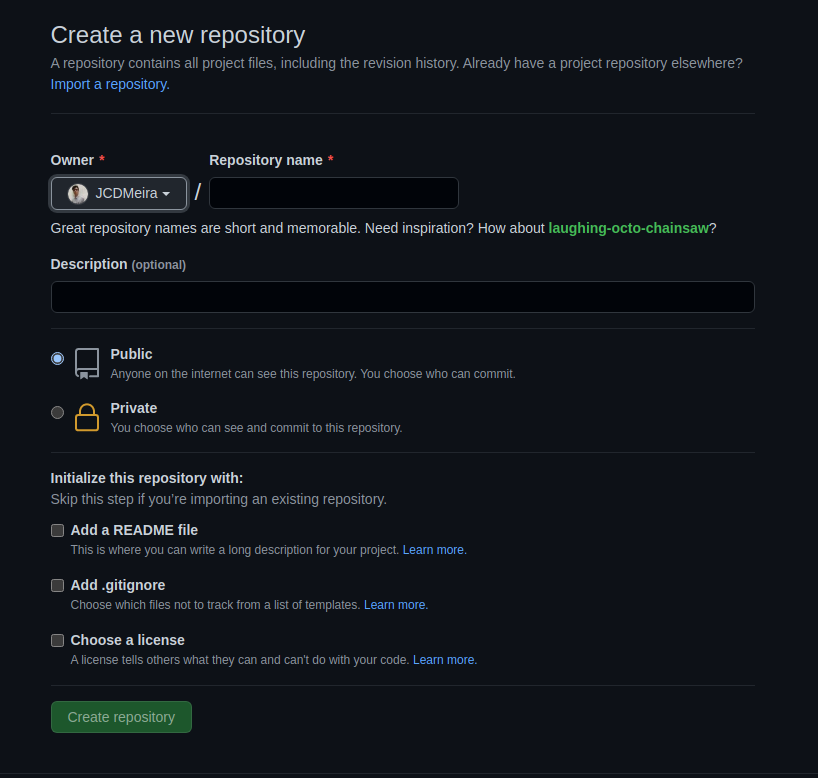
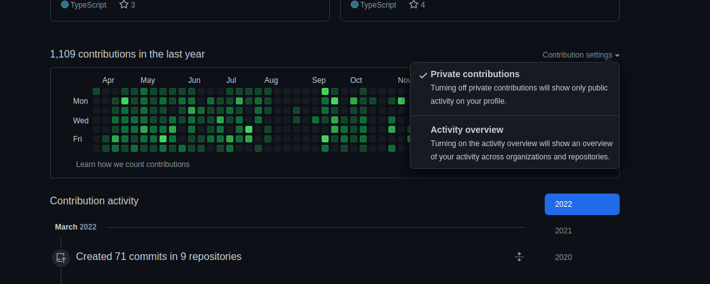
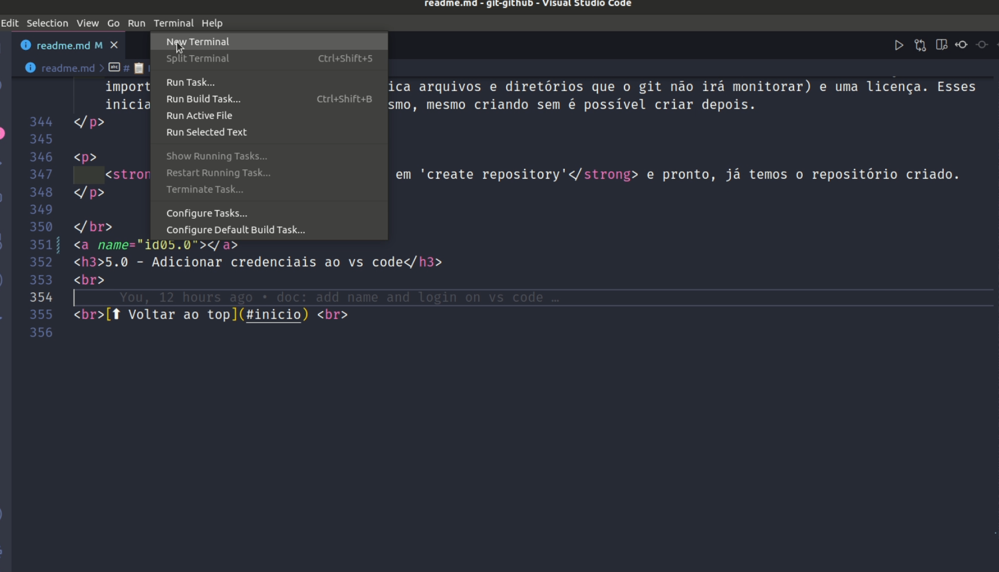
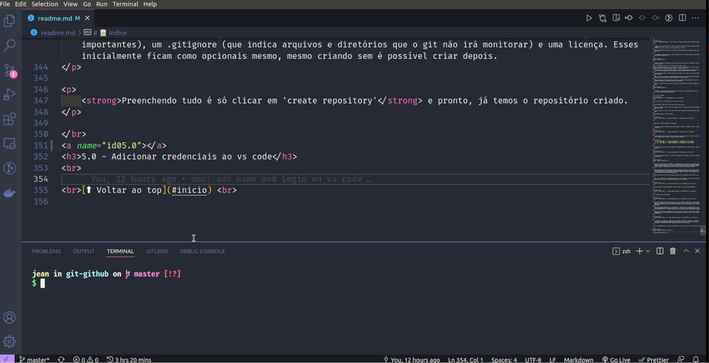
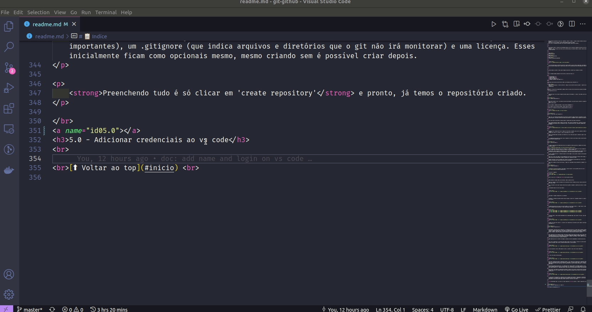
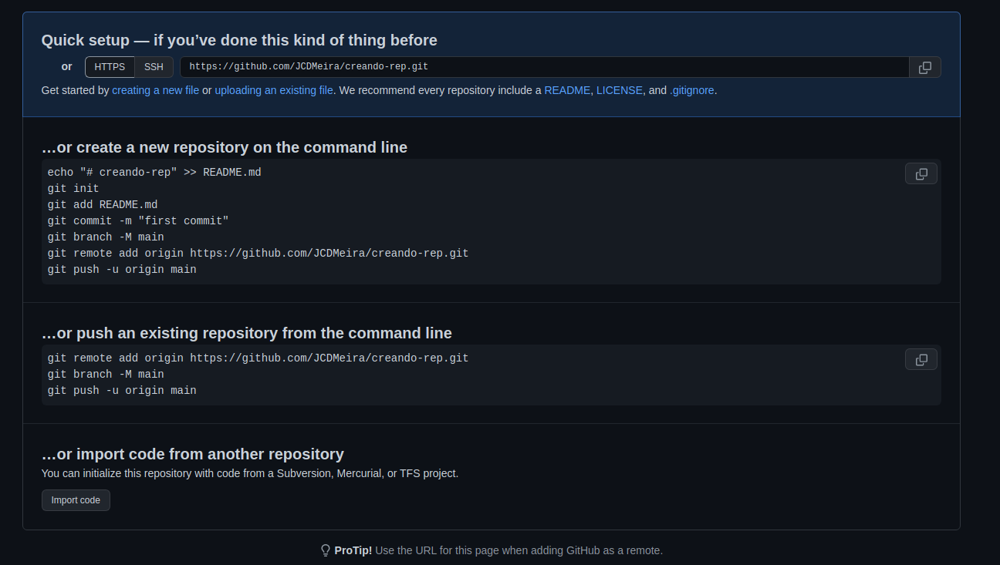
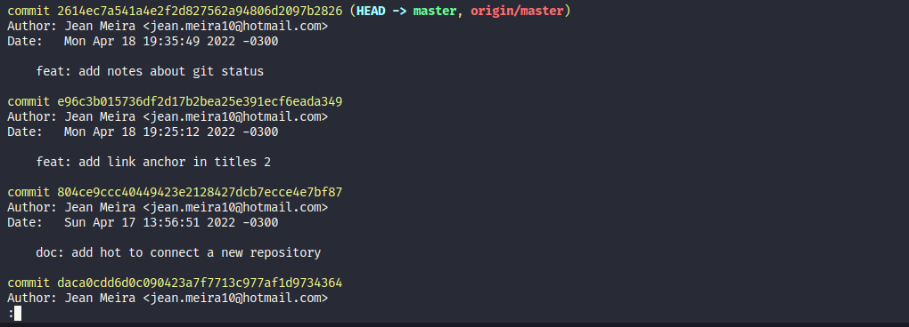
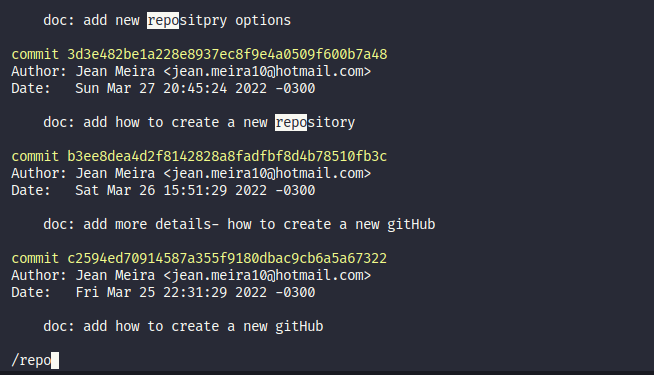
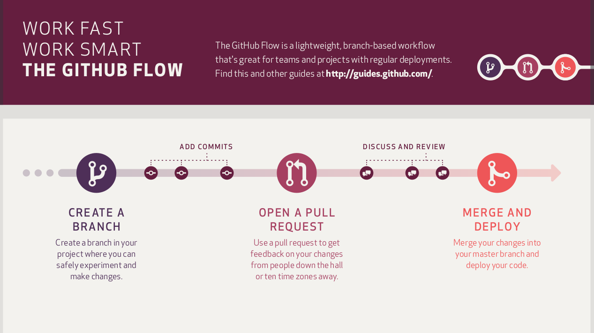

<h1 align='center' name='inicio' id='inicio'>
    Git e GitHub: um guia de estudo, procedimentos e tópicos importantes
</h1>

<div align='center'>
    
</div>
</br>

# 📋 Indíce

- [1.0 - O que é git ?](#id01)
  - [1.1 - Detalhes importantes](#id01.1)
- [2.0 - Ta, mas como o git funciona?](#id02.0)
  - [2.1 - Ciclos de vida](#id02.1)
- [3.0 - Criando um gitHub](#id03.0)
- [4.0 - Criando um repositório](#id04.0)
- [5.0 - Adicionar credenciais ao vs code](#id05.0)
- [6.0 - Conectando um repositório a uma origen remota](#id06.0)
- [7.0 - Comandos](#id07.0)
  - [7.1 - Git status](#id07.1)
  - [7.2 - Git log](#id07.2)
  - [7.3 - Git add](#id07.3)
  - [7.4 - Git commit](#id07.4)
  - [7.5 - Git push](#id07.5)
  - [7.6 - Git pull](#id07.6)
  - [7.7 - Git checkout](#id07.7)
  - [7.8 - Git merge](#id07.8)
- [8.0 - gitignore](#id08.0)
- [9.0 - Conventional commits](#id09.0)
- [10.0 - git workflow](#id10.0)
  - [10.1 - Fluxo iniciante - aprendendo a usar git](#id10.1)
  - [10.2 - Fluxo de desenvolvimento individual](#id10.2)
  - [10.3 - Workflow esperado em equipes](#id10.3)
- [11.0 - Encerramento e extras](#id11.0)

</br>
<p>
    Esse repositório reúne meus estudos e testes sobre git e gitHub. Será um apanhado de informações, se sinta livre
    para ler, salvar, forkar ou compartilhar o projeto, e se achar correções ou melhorias sua contribuição é bem vinda.
</p>

</br>

<p>
    Lembrando que todo tipo de opinião sobre o uso de algum conceito ou ferramenta também está atrelado a minha visão da
    forma de se usar ou proceder. Sendo então parcial e não passando de uma recomendação, se acaso algo for normativo
    irei indicar em conjunto a própria informação da mesma.
</p>

</br>

<p align="center">
    E se gostou do conteúdo deixe uma estrela para incentivar o trabalho.
</p>

</br>
<a name="id01"></a>
<h2>1.0 - O que é git ?</h2>
<div align='right'>
    <a href="#inicio">⬆ Voltar ao top</a>
</div>

</br>

<p>
    Git é uma ferramenta de versionamento de código, e serve literalmente para criar versões, igual quando temos
    aplicativos com 1.0, 1.2, 2.5 e por aí vai.
    Não entrando em questões de como isso é numerado, a ideia é a mesma, é criado múltiplas versões do item em questão,
    que no caso se faça de código, ou mais especificamente arquivos de código.
    Porém o git é tão poderoso que pode criar versões de qualquer arquivo que se desejar.
</p>

</br>

<p>
    Para explicar melhor o conceito de versionamento pode-se citar os diversos trabalhos de escola ou um TCC de curso ou
    graduação. Sempre se inicia com um nome, porém conforme passa por revisões tende-se a mudar o nome do arquivo,
    virando algo como:
</p>

</br>

<p align="center">
    Trabalho-revisado
</p>
<p align="center">
    Trabalho-revisado-final
</p>
<p align="center">
    Trabalho-revisado-final-agoraVai
</p>

</br>

<div align='center'>
    
</div>

<p>
    E isso dificulta muito o controle por que não é possível saber o que foi feito em cada parte, nem mesmo olhando
    daria pra saber exatamente qual a ordem em que vieram. Pois se houverem mais marcações pode gerar confuções.
</p>

</br>

<p>
    Com git poderia se manter o nome e geral códigos de marcação e comentários, marcando as versões.
</p>

</br>

<p>Git te responde algumas perguntas básicas sobre as alterações feitas.</p>

</br>
<ol>
    <li>O que mudou ?</li>
    <li>Quando mudou ?</li>
    <li>Por que mudou?</li>
    <li>Quem fez a mudança?</li>
    <li>Podemos reproduzir essa mudança?</li>
</ol>
</br>

<p>Isso gera uma estrutura de marcações de commit, que evidencia essas informações.</p>
</br>

<p align="center">
    nome do Trabalho(arquivo) - data de alteração - código único de alteração (hash do commit) - comentário de alteração
    - quem alterou
</p>

</br>
<p>E quanto a replicação do comportamento, podemos conferir nas descrições de alteração dos arquivos alterados ou clonar
    o repositório em si</p>

</br>

<p>
    Seria muito mais fácil de fazer trabalho em grupo usando um versionador, e a ideia é essa mesma, porém com códigos.
</p>

</br>
<a name="id01.1"></a>
<h3>1.1 - Detalhes importantes</h3>
<div align='right'>
    <a href="#inicio">⬆ Voltar ao top</a>
</div>
<br>

<li>
    Mais especificamente o git é um sistema de controle distribuido e isso que facilita e permite a colaboração em grupo
    para um mesmo projeto
</li>

<li>Git na verdade é chamado de GIT-SCM -> source control management</li>

<li>Foi criado por Linus Torvalds em 2005, o mesmo criador do linux</li>

<li>Nasceu com o propósito de auxiliar no desenvolvimento do linux</li>

<br>
<div align='center'>
    
</div>

</br>
<a name="id02.0"></a>
<h3>2.0 - Ta, mas como o git funciona?</h3>
<div align='right'>
    <a href="#inicio">⬆ Voltar ao top</a>
</div>
<br>

<p>
    Como o git é um sistema de gerenciamento de controle de versões de código (arquivos e documentos se olhar de modo mais geral), ele possui recursos avançados para monitorar e acompanhar o que os arquivos do projeto em si.
</p>

<p>
    Isso conta tanto em alterações no arquivo quanto o caminho dentro das pastas (diretórios).
</p>
<p>
    Isso o permite monitorar todas as mudanças ocorridas, logo a partir do momento que é iniciado no projeto. Geralmente esse processo ocorre no repositório local, e a cada alteração isso é indicado e mapeado pela ferramenta.
</p>

<br>
<div align='center'>
    
</div>
</br>

<p>
    A primeira parte indicada mostra que o código era como estava a esquerda, mas isso foi removido e então está em vermelho.
    E então ficou como está a direita, e como foi adicionado está em verde.
</p>
<p>
    Sendo na realidade apenas uma mudança de formatação, por isso indica que algo foi removido e agora se tem um novo bloco.
</p>

<p>
    Já a segunda parte que mostra um espaço vazio a esquerda e um texto em com fundo em verde a direita mostra adição de parte totalmente novas.
</p>

</br>
<a name="id02.1"></a>
<h3>2.1 - Ciclos de vida</h3>
<div align='right'>
    <a href="#inicio">⬆ Voltar ao top</a>
</div>
<br>

<p>
    As mudanças monitoradas são demonstrada através de um poderoso sistema que pode ser chamado como relativo a estágios ou fases.
</p>

<br>
<p>Cada fase representa algo que ocorre com os arquivos, há imagens com mais detalhes ou até mais comandos ou relações a estados. Mas o primeiro contato está relativo a um ciclo resumido.</p>
<p>
    De modo geral, após se linkar um repositório ao git, o sistema git está monitorando esses arquivos, mas eles não foram se quer adicionados para o monitoramentos, então ficam contando estado como untracked.
</p>
<p>
    Ao usar o comando git add, e o estado do arquivo se torna staged, ou seja, agora o arquivo se torna monitorado pelo sistema git.
</p>
<p>
    Após isso, se usar o git commit se torna unmodified, que diz que as alterações do arquivo estão fixadas, e também estão como não modificados e podem ser upados para o repositório remoto.
</p>
<p>
    Qualquer alterações a partir do momento que o arquivo foi adicionado ao monitoramento git, ele se torna modified, indicando que a modificações que devem ser adicionadas.
</p>
<p>
    Esses são os estados ou fases básicas dp git, a seguir será mencionado com mais detalhes os comandos e ações em geral.
</p>
</br>
<a name="id03.0"></a>
<h3>3.0 - Criando um gitHub</h3>
<div align='right'>
    <a href="#inicio">⬆ Voltar ao top</a>
</div>
<br>

<p>
    O processo de criação de um gitHub é bem simples é preciso acessar o site do gitHub através do link <a href="https://github.com">https://github.com</a>.
</p>

<p>
    A tela será a seguinte:
</p>
<div align='center'>

</div>
</br>
<p>
    Deve se clicar em <strong>Sign up</strong> no canto superior direito.
</p>

<p>
    Então preencher os dados comuns, que são email, senha e nome de usuário.
</p>
<p>
    Também será pedido um número de código que foi enviado para e-mail informado nos daos. Como uma confirmação para e-mail válido.
</p>
<p>
    Daí é só escolher se você quer receber notificações do gitHub e responder o captcha para concluir a primeira etapa.
</p>
<p>
    O procedimento pode ser visto na gif abaixo :
</p>
</br>

<div align='center'>
    
</div>

</br>

<p>
    Logo depois há algumas configurações a se preencher
</p>

<p>
    O primeiro é a pergunta de quantas pessaos atuam na equipe, no geral será respondido "apenas eu", porque é sua conta pessoal. 
</p>

</br>
<div align='center'>
    
</div>

</br>
<p>
    O segundo são possíveis usos para sua conta do gitHub, se tiver focos em mente já é legal colocar. Se não tiver, recomendo colocar pelo menos o último, que menciona comunidade. 
</p>

</br>
<div align='center'>
    
    
    
</div>

</br>
<p>
    O terceiro tópico é sobre escolher modalidade free ou modalidade paga, aqui escolha o free que é mais que suficiente.
</p>

</br>
<div align='center'>
    
</div>

<p>
    E pronto, sua conta esta criada e já é possível criar repositórios com projetos, gerar commits e participar da comunidade em si.
</p>

</br>
<a name="id04.0"></a>
<h3>4.0 - Criando um repositório</h3>
<div align='right'>
    <a href="#inicio">⬆ Voltar ao top</a>
</div>
<br>

<p>
    Primeiramente, cabe dizer que um repositório é no sentido do dicionário, um lugar onde se armazena, guarda, arquiva ou coleciona alguma coisa. E nesse caso, um repositório git se destina, primáriamente, a guardar projetos e códigos. Assim como temos a ferramenta git monitorando as versões dos nossos arquivos dentro de um projeto, teremos os repositórios para alocar os projetos e suas estruturas de pastas e arquivos. 
</p>

<p>
    Esses repositórios são um ambiente remoto, que alocam os dados em uma espécie de nuvem. Assim, nossos códigos versionados podem ficar em um lugar seguro. E nos permite compartilhar códigos e projetos, demonstrar a evolução dos projetos em si e da nossa maneira de codar e trabalhar com projetos. Além de também nos permitir criar uma espécie de portfólio e mapa de trajetória. 
</p>
<p>
    Sendo também possível ter contato com códigos e projetos de outros programadores e projetos open source.
</p>

<p>
    Para criar um repositório é um processo bem simples. Basta clicar no simbolo + (de mais) no canto direito superior da página. Estará entre o sininho de notificações e a foto de perfil.
</p>

<br>
<div align='center'>
    
</div>

<p>
    Ao clicar aparecerá opções. Então aparecerá opções, a primeira é para criar um novo repositório.
</p>

<br>
<div align='center'>
    
</div>

<p>
    Irá abrir uma janela conforme abaixo.
</p>

<br>
<div align='center'>
    
</div>

<p>
    você estará colocado como dono do repositório (owner), e será necessário um nome para ele (repository name). A descrição (Description) do que é esse repositório é opicional, eu costumo colocar após já fazer coisas no repositório, pois terei uma visão mais clara de como descrevê-lo, porém se decidir adicionar já na abertura já pode também.
</p>
<p>
    Uma opção logo abaixo da descrição é se o repositório será público (public) ou privado (private), se for público qualquer pessoa que acessar seu perfil poderá ver o repositório, se for privado apenas você ou quem tiver permição poderá ver. É importante colocar como público caso sejam projetos pessoais e para portfólio.
</p>
<p>
    Outro detalhe é que commits em repositórios privados só contam se você ativar a opção de mostrar contribuições privadas. Caso contrário, qualquer commit feito em repositórios privados não irão contar no seu histórico de contribuições.
</p>

<br>
<div align='center'>
    
</div>

<p>
    A última parte de configurações é adicionar ou não um readme (para descrever o repositório e informações importantes), um .gitignore (que indica arquivos e diretórios que o git não irá monitorar) e uma licença. Esses inicialmente ficam como opcionais mesmo, mesmo criando sem é possível criar depois.
</p>

<p>
    <strong>Preenchendo tudo é só clicar em 'create repository'</strong> e pronto, já temos o repositório criado.
</p>

</br>
<a name="id05.0"></a> 
<h3>5.0 - Adicionar credenciais ao vs code</h3>
<div align='right'>
    <a href="#inicio">⬆ Voltar ao top</a>
</div>
<br>

<p>
    Adicionar suas credenciais é necessário para que os commits fiquem registrados no seu nome. Sendo fácil de entender quem fez que alteração e também para preencher o histórico de commits na página inicial do seu gitHub.
</p>
<p>
    O processo todo é bem fácil, podendo entrar no terminal integrado do vs code pra isso, sendo esse terminal qual for. O processo vai ser clicar em terminal na parte superior esquerda.
</p>

<br>
<div align='center'>
    
</div>
<br>

<p>
    E então o terminal que está definido como padrão do vs code irá abrir na parte inferior. Sendo o meu o ZSH.
</p>

<br>
<div align='center'>
    
</div>
<br>

<p>
    O processo pode ser visto abaixo:
</p>

<br>
<div align='center'>
    
</div>
<br>

<p>
    Então será inserido o nome e e-mail de usuário.
</p>

<p>
    Para configurar as credenciais para apenas o projeto que está mexendo no momento, deve se usar os comandos abaixo, setando nome e e-mail para o projeto, de modo local.
</p>

```bash
# configura o nome de usuário de modo local
git config  user.name "Um nome maneiro"
```

```bash
# configura o email de usuário de modo local
git config  user.email "email.maneiro@exemplo.br"
```

<p>
    Já para configurar o nome e e-mail de forma global, se usa o mesmo comando, mas adicionando a flag --global. Que faz com que o nome e usuário sejam definidos para o computador. E todo projeto que você mexer com esse computador irá usar essas credenciais por padrão, a não ser que seja mudado ou configurado um outro nome e e-mail localmente para um projeto após sua abertura.
</p>

```bash
# configura o nome de usuário de modo global
git config --global user.name "Um nome maneiro"
```

```bash
# configura o email de usuário de modo global
git config --global user.email "email.maneiro@exemplo.br"
```

<p>
    Após qualquer um dos comandos de configuração o usuário está configurado e é possível enviar commits assinados por você.
</p>

<strong>Só cabe lembrar que não é recomendado usar configurações globais em um computador que possa ser acessado por várias pessoas.</strong>

</br>
<a name="id06.0"></a> 
<h3>6.0 - Conectando um repositório a uma origen remota</h3>
<div align='right'>
    <a href="#inicio">⬆ Voltar ao top</a>
</div>
<br>

<p>
    Para enviar os commits feitos localmente para um repositório remoto é preciso definir a origem em que se encontra esse repositório. Há mais de uma maneira de fazer isso, mas talvez a mais rápida e simples é via um endereço HTTPS. Que já é fornecido pelo gutHub ao criar uma repositório.
</p>

<br>

<br>

<p>
    Após criar o repositório no github, crie uma pasta local que conterá seu projeto, servindo como um repositório local. Nele digite o comando de git init para iniciar o monitoramento git nos arquivos.
</p>
<br>

```bash
git init
```

<p>
    Então pegue o comando da primeira linha do segundo bloco da imagem anterior.
</p>

```bash
git remote add origin https://github.com/JCDMeira/creando-rep.gi
```

<p>
    Isso adicionará a origin ao repositório, sendo possível agora adicionar os arquivos e subir para o repositório remoto.
</p>

<P>
    Já quanto ao processo de subir os dados propriamente ditos vamos ver em breve mais a frente.
</P>

</br>
<a name="id07.0"></a>
<h2>7.0 - Comandos</h2>
<div align='right'>
    <a href="#inicio">⬆ Voltar ao top</a>
</div>
</br>

<p>
    No geral tudo no git será realizado por comandos, e aprender a manipular as situações via comandos é essencial. Até é possível hoje em dia manipular tudo via interface, mas isso te torna nada mais que um apertador de botões.
</p>
<p>
    Aprender realmente a usar os comandos é que te torna um melhor profissional, e após masterizar os comandos, mesmo que não seja completamente (isso seria muito difícil), é possível usar a interface a seu favor em alguns casos.
</p>

</br>
<a name="id07.1"></a>
<h2>7.1 - Git status</h2>
<div align='right'>
    <a href="#inicio">⬆ Voltar ao top</a>
</div>
</br>

<p>
    O comando <strong>git status</strong> serve para ver os status atuais de cada arquivo no projeto. Permitindo ver em que momento do ciclo de vida eles estão.
</p>
<p>
    Permitindo com isso entender quais são os próximos passos para manipular esses arquivos.
</p>

</br>
<a name="id07.2"></a>
<h2>7.1 - Git log</h2>
<div align='right'>
    <a href="#inicio">⬆ Voltar ao top</a>
</div>
</br>

<p>
    O comando <strong>git log</strong> permite que seja visto o histórico de commits do projeto. 
</p>
<p>
    O log simples mostra apenas os últimos commits feitos, mas é possível usar <strong>git log --all</strong> para mostrar todos os commits feitos. Ou o <strong>git log --oneline</strong> para mostrar os últimos com informações resumidas.
</p>
<p>
    Outro fator importante de se notar é que o comando abre um modo diferente no terminal. <strong>E para sair do modo log é só apertar a tecla q do teclado</strong>
</p>



<p>
    Outra função importante do log, mas que é pouco conhecida, é que há uma função de pesquisa no comando. Enquanto na tela de log se teclar <strong>/</strong> entra em um modo de pesquisa, que permite pesquisar por palavras que aparecem nas mensagens dos commits.
</p>



<p>
    Após executar uma pesquisa é possível voltar para o todo dos commits apertando a tecla <strong>b</strong>
</p>

<p>
    Além disso há outras flags além de all que podem ser úteis
</p>

<p>
    Pesquisar commits anteriores a uma data:
    <strong>git log --before="2022-04-01"</strong>
</p>

<p>
    Pesquisar commits posteriores a uma data:
    <strong>git log --after="2022-04-01"</strong>
</p>

<p>
    Pesquisar commits entre datas:
    <strong>
        git log --before="2022-04-01" --after="2022-06-01" 
    </strong>
</p>

<p>
    Pesquisar commits desde:
    <strong>
        git log --since="2 days ago"
    </strong>
</p>

<p>
    pesquisar commits por autor:
    <strong>
        git log --author="jean"
    </strong>
</p>

<p>
    Esses recursos permitem fazer uma busca mais focada nos commits feitos. 
</p>

</br>
<a name="id07.3"></a>
<h2>7.1 - Git add</h2>
<div align='right'>
    <a href="#inicio">⬆ Voltar ao top</a>
</div>
</br>

<p>
    O comando <strong>git add</strong> permite adicionar os arquivos e diretórios para o estado de tracked, ou seja, monitorados. Há diversas formas diferentes de se usar o comando, divergindo o comportamento do mesmo.
</p>

<strong>Adicionar um arquivo ou diretório</strong>

<p>git add caminho_do_arquivo-diretorio</p>
<p>
    Um exemplo para algo que esteja na raiz.
</p>

<strong>
    Para o arquivo readme que está na raiz.
</strong>
<p>
    git add readme.md
</p>
<strong>
    Para o diretório images que está na raiz.
</strong>
<p>
    git add images/
</p>

<strong>
    Adicionar todos arquivos e diretórios novos, modificados e deletados. do diretório atual em diante.
</strong>
<p>git add .</p>
<p>
    Ao usar o ponto, todos os arquivos e pastas são registrados. Sejam novos arquivos, as mudanças feitas em um arquivo já monitorado ou mesmo arquivos que foram deletados. Todas alterações são computadas.
</p>
<p>
    Um ponto de alerta para usar o ponto é que se estiver dentro de um diretório no projeto e não na raiz. As alterações que serão contadas é do ponto do projeto em que se está em diantes (pastas e arquivos dentro da pasta atual).
</p>

<strong>
    Adicionar todos arquivos e diretórios todos arquivos, da raiz em diante
</strong>
<p>git add --all ou git add -A </p>
<p>
    Usar --all ou -A garante o mesmo comportamento do git add . com a diferença que o ponto de partida vai ser a raiz do projeto. Sendo sempre adicionada todas as alterações do projeto.
</p>

<strong>
    Adicionar no Stage apenas arquivos modificados e removidos, não adicionando os novos arquivos.
</strong>
<p>
    git add -u
</p>
<p>
    A flag -u faz com que os novos arquivos não tenham suas mudanças adicionadas. Apenas arquivos que já existiam, e pode haver alterações no arquivo ou mesmo o a ação de deletar o arquivo todo.
</p>

<strong>
    Adicionar todos arquivos novos e diretórios, do repositório em diante. Mas não conta os arquivos deletados.
</strong>
<p>git add * </p>

<p>
    O git add * não computa deleções, e por isso serve um grande aviso aqui, dependendo de como estiver seu projeto, usar muito o comando com o asterisco irá gerar conflitos. Pois o uso de pull e push não irão contar arquivos deletados, e isso pode conflitar em algum momento (tende fortemente a gerar conflitos).
</p>

<p>
    Em pesquisas vi dizeres de que o comando com o asterisco não adicionava arquivos começados em . também, mas nos testes que fiz a única diferença dele para o git add . foi não computar deleções.
</p>

</br>
<a name="id07.4"></a>
<h2>7.4 - Git commit</h2>
<div align='right'>
    <a href="#inicio">⬆ Voltar ao top</a>
</div>
</br>

<p>
    commits são a passagem dos arquivos que estão trackeados para o estatus staged.
    Deixando eles prontos para enviar ou submeter para o repositório remoto (principal).
</p>
<p>
    Os commits são o ato de efetivar as mudanças feitas, sejam ela alterações, remoções ou adições.
</p>
<p>
    O commit cria uma espécie de "fotografia" do momento atual do projeto, e essa fotografia é marcada por um hash_id. Que nada mais é que uma sequencia alfa numérica única, que define aquele momento do projeto. 
</p>
<p>
    Com momento se entende o estado que cada arquivo tinha, a estrutura de pastas e tudo que o projeto continha naquele commit. Sendo possível assim criar um histórico de alterações e voltar a um determinado commit se necessário.
</p>

<p>
    Em geral nos commmits se passa uma mensagem, através da flag -m, essa mensagem fala de modo resumido o que foi a alteração causada por aquele commit.
</p>

<p>
    <strong>
        gi commit -m 'mensagem do commit'
    </strong>
</p>

</br>
<a name="id07.5"></a>
<h2>7.5 - Git push</h2>
<div align='right'>
    <a href="#inicio">⬆ Voltar ao top</a>
</div>
</br>

<p>
    O git push envia as alterações commitadas localmente para o repositório marcado como a origin remota. Do ingles push é empurrar, e é de certa forma isso que é feito, os commits são "empurrados" para o repositório remoto.
</p>

<p>
    <strong>
        git push
    </strong>
</p>

<p>
    Uma informação importante é que geralmente o push precisa indicar a origin a qual se quer enviar os commits. Que geralmente será a branch que se quer que receba os commits.
</p>

<p>
    <strong>
        git push origin minha_origin
    </strong>
</p>

<p>
    Para facilitar é possivel configurar uma origin para aquela branch. E assim ela fica salva e todo commit após isso fica direcionado aquela origin.
</p>

<p>
    <strong>
        git push --set-upstrean origin minha_origin
    </strong>
</p>

<p>
    O que também pode ser feito usando a flag -u que vem de upstrean
</p>

<p>
    <strong>
        git push -u origin minha_origin
    </strong>
</p>

</br>
<a name="id07.6"></a>
<h2>7.6 - Git pull</h2>
<div align='right'>
    <a href="#inicio">⬆ Voltar ao top</a>
</div>
</br>

<p>
    O git pull serve para atualizar seu repositório local com as alterações do remoto. Pull do inglês é puxar, então é o mesmo que literalmente "puxar" as novas alterações que existem no remoto.
</p>
<p>
    É muito útil quando se trabalhar em equipe ou quando se faz alguma alteração diretamente no remoto. 
</p>
<p>
    O comando indica de onde do repositório remoto se quer puxar os dados e qual branch local vai receber.
</p>

<p>
    <strong>git pull (remote) (branch)</strong>
</p>

<p>
    No caso de origin se trata da origin setada para essa branch
</p>
<p>
    <strong>git pull origin master</strong>
</p>

<p>
    Se passado apenas um argumento se trata do local remoto, sendo entendido como o local será a branch atual.
</p>
<p>
    <strong>git pull (remote)</strong>
</p>

<p>
    Sem argumento algum trata da referência da branch atual, tanto pegar dados da origin configurada para branch. quando a própria branch em que estamos para receber.
</p>
<p>
    <strong>git pull </strong>
</p>

</br>
<a name="id07.7"></a>
<h2>7.7 - Git checkout</h2>
<div align='right'>
    <a href="#inicio">⬆ Voltar ao top</a>
</div>
</br>

<p>
    git checkout é o comando que nos permite navegar entre as diversas branchs do projeto.
</p>
<p>
    Branch vem do inglês, significa ramo. Ter múltiplas branchs é como ter diversas linhas do tempo num projeto. Podendo ter cada qual o seu objetivo único. Uma branch vai compartilhar os arquivos da branch que originou ela. Ou seja, ao criar um branch chamada minha_branch a partir do ramo master, temos tudo que ocorreu no ramo master na branch minha_branch também. 
</p>
<p>
    Porém vale lembrar que tudo que ocorrer em master após a criação de minha_branch não estará disponível em minha_branch. Assim como o que for criado nesse novo ramo também não estará em master.
</p>
<p>
    A não ser que comandos como pull ou merge (entre outros) sejam usados para fazer os ramos terem o que o outro criou após a separaçao da linha do tempo.
</p>

<p>
    E é justamento o checkout que permite a navegação pelas branchs. O comando a seguir sairia do ramo atual para o chamado de minha_branch.
</p>
<p>
    <strong>git checkout minha_branch</strong>
</p>

<p>
    Se acaso quiser criar uma branch é possível usar a flag -b no comando checkout.
</p>
<p>
    <strong>git checkout -b minha_nova_branch</strong>
</p>

<p>
    O comando acima criaria uma branch chamada minha_nova_branch
</p>

<p>
    Se não quiser mais usar uma branch é possível ainda apagar a mesma, usando o comando branch com a flag -d
</p>
<p>
    <strong>git branch -d minha_branch</strong>
</p>

<p>
    Porém dessa forma só é possível deletar branchs que não contenham alterações a serem commitadas. Acaso se queira deletar branchs com alterações ainda por commitar se deve forçar a deleção, usando o D maiúsculo.
</p>
<p>
    <strong>git branch -D minha_branch</strong>
</p>

</br>
<a name="id07.8"></a>
<h2>7.8 - Git merge</h2>
<div align='right'>
    <a href="#inicio">⬆ Voltar ao top</a>
</div>
</br>

<p>
    O comando merge uni dois ramos, depositando as alterações de um ramo no ramo atual, ou seja, pega as alterações commitadas de um ramo e mescla no ramo em que estamos nesse momento.
</p>

<p>
    Se estivermos em master e usarmos o comando a seguir, mesclariamos as alterações de minha_branch em master.
</p>

<p>
    <strong>git merge minha_branch</strong>
</p>

<p>
    Isso também é possível de fazer na interface online, mas não vem ao caso no momento.
</p>

</br>
<a name="id08.0"></a>
<h2>8.0 - gitignore</h2>
<div align='right'>
    <a href="#inicio">⬆ Voltar ao top</a>
</div>
</br>

<p>
    O arquivo .gitignore serve para ignorar arquivos e suas mudanças. O git não irá "olhar" para arquivos ou diretórios inseridos no corpo do arquivo chamado .gitignore, sendo assim não são assistidos ou monitorados pelo git.
</p>

<p>
    Alguns exemplos de maneiras de colocar estará abaixo.
</p>

<p>
    Ignorar um arquivo
</p>
<p>
    <strong>
        teste.js
    </strong>
</p>

<p>
    Ignorar todos os arquivos da mesma extensão
</p>
<p>
    <strong>
        *.js
    </strong>
</p>

<p>
    Ignorar diretórios 
</p>
<p>
    <strong>
        images/
    </strong>
</p>

<p>
    Ignorar diretórios (buscando sub-diretórios também)
</p>
<p>
    <strong>
        **images
    </strong>
</p>

<p>
    Também é possível 'instalar' uma versão padrão de .gitignore
</p>
<p>
    Para isso basta rodar o seguinte comando no seu projeto
</p>

<p>
    <strong>
        npx gitignore node
    </strong>
</p>

<p>
    O arquivo virá com diversos cases padrões tendo em conta o node para esse caso, e é possível adicionar ou remover o que desejar do corpo do arquivo.
</p>
<p>
    E para qualquer gitignore, é possível usar # para criar comentários.
</p>

</br>
<a name="id09.0"></a>
<h2>9.0 - Conventional commits</h2>
<div align='right'>
    <a href="#inicio">⬆ Voltar ao top</a>
</div>
</br>

<p>
    Em projetos é muito comum se fazer um número incalculável de commits, ainda mais em projetos grandes que perduram ao longo do tempo. E isso resulta em uma necessidade, a padronização de commits, e aqui não é somente adequal um molde que todos que trabalham naquele projeto façam mensagens de commits parecidas. É mais sobre conseguir tirar informações úteis da mensagem do commit. 
</p>
<p>
    Há uma necessidade que também é comentada para códigos, sejam para nomes de variváveis, funções e classes. Ou para a maneira geral de se escrever o código. Sempre há uma necessidade de semântica muito bem colocada.
</p>
<p>
    No dicionário semântica é "Semântica é o estudo do significado. Incide sobre a relação entre significantes, tais como palavras, frases, sinais e símbolos, e o que eles representam, a sua denotação. A semântica linguística estuda o significado usado por seres humanos para se expressar através da linguagem." segundo a wikipédia. É nada mais que o sentido das palavras, e nesse caso, se o que se coloca de nomes dentro do código estão condizentes com seus funcionamentos dentro do arquivo e projeto. E acredite, a semântica ajuda demais na compreenção.
</p>
<p>
    Para commits, semântica irá ajudar a entender melhor o que é feito de mudança naquele commit, ou seja, que tipo de alterações foram realizadas.
</p>

<p>
    Portanto, os commits convencionais nada mais são que commits com semântica. E os mesmos não servem apenas para projetos grandes e com equipes. Se você quer melhorar a qualidade do seu desenvolvimento, deve usar os Conventional commits, subir o projeto todo em um commits não traz a história por trás do progresso do projeto.
</p>
<p>
    Ao usar commits pequenos e bem colocados é possível mostrar todo o histórico e a maneira com que algo foi desenvolvido, de maneira muito mais clara e objetiva.
</p>

<p>
    A estrutura esperada do commit é:
</p>

<p>
    <strong>tipo(escopo |?| ): mensagem <p>(Mensagem com detalhes mais explicados |?| )</p> <p>footer |?| </p></strong>
</p>
<p>
    Footer é para informações adicionais, podendo também passar closes #id_issue, para fazer o commit fechar issues automáticamente.
</p>

<p>
    Sendo que os campos com |?| são opcionais.
</p>

<p>
    As opções de tipo de commits são:
</p>

<ol>
    <li>
        <strong>feat</strong> - Um inclusão de um novo recurso (se relaciona com o MINOR do versionamento semântico, ou seja, são mudanças que não compõe um versão inteira, mas geral novos recursos, o mesmo que dizer que alterou a versão de um software de 1.0 para 1.1).
    </li>
    <li>
        <strong>docs</strong> - Mudanças na documentação, No readme ou em outras docs. (Não inclui mudanças em arquivos de código).
    </li>
    <li>
        <strong>style</strong> - Alterações referentes a formatações de código, semicolons, trailing spaces, lint... (espaço em branco, formatação, ponto e vírgula ausente etc.).
    </li>
    <li>
        <strong>refactor</strong> - Mudança por refatorações de código, como por exemplo, uma alteração no formato como é processada determinada parte da tela, mas que manteve a mesma funcionalidade, melhorias de performance devido a um code review ou ainda melhorias da apresentação do código para melhor compreenção de desenvolvedores.
    </li>
    <li>
        <strong>build</strong> - Commits do tipo build são utilizados quando são realizadas modificações em arquivos de build e dependências.
    </li>
    <li>
        <strong>test</strong> - Altera arquivos de testes, seja criando, alterando ou excluindo testes unitários. (Não inclui alterações em código).
    </li>
    <li>
        <strong>chore</strong> - Atualiza tarefas que não geram alterações no código de produção, mas mudanças de ferramentas, mudanças de configuração e bibliotecas que realmente não entram em produção. (Não inclui alterações em código).
    </li>
    <li>
        <strong>perf</strong> - Vem de performance. altera códigos com objetivo de melhorar o desempenho.
    </li>
    <li>
        <strong>ci</strong> - Altera arquivos e scripts de configuração de CI (exemplo: Travis, Circle, BrowserStack, SauceLabs).
    </li>
    <li>
        <strong>env</strong> - basicamente utilizado na descrição de modificações ou adições em arquivos de configuração em processos e métodos de integração contínua (CI), como parâmetros em arquivos de configuração de containers.
    </li>
</ol>

<p>
    Exemplos de commits:
</p>
<p>
    <strong>git commit -m "feat: add Home</strong>
</p>

<p>
    <strong>git commit -m "fix(Home): Title <p>Corrige erro de tipografia</p> <p>closes #1</p></strong>
</p>

</br>
<a name="id10.0"></a>
<h2>10.0 - git workflow</h2>
<div align='right'>
    <a href="#inicio">⬆ Voltar ao top</a>
</div>
</br>

<p>
    Aqui nessa sessão quando falo em git workflow se trata de certas maneiras de se trabalhar com git, como a própria tradução seria, fluxos de trabalho com git. Ou seja, trabalhar com o versionamento de uma forma ou outra. 
</p>
<p>
    Já adianto que essa parte terão mais de minhas opniões e minha vivência. Você leitor é livre para adotar ou não, concordar ou não. Enfim, trabalhar com o versionamento é algo que está no dia a dia do programador, seja trabalhando sozinho, com equipe ou mesmo ao fazer projetos testes e portfólio. E acredito que não haja exatamente um certo e errado, tudo vai se basear em padrões e formas adotadas.
</p>

<p>
    Mas se você está começando a aprender programação, ou fazendo uma transição de carreira, como eu fiz em algum momento. Você pode estar se deparando com um mundo enorme de conteúdos distintos e ao mesmo tempo necessário e correlatos. Você pode estar vendo coisas de front-end como html, css, js e frameworks/bibliotecas ou mais a parte de back-end com rotas, métodos http, api's, end-point e além de todas essas coisas está tendo que ver git e versionamento de código. 
</p>
<p>
    Sim, são várias coisas para aprender. E pode gerar um pouco de desconforto no começo. Principalmente o fato de usar o terminal para executar o git. E acredite, essa é uma reclamação que ouço muito do pessoal que está começando ou até de pessoas que já estão programando bem e não acostumaram a usar terminal para comandos git desde o começo. 
</p>

<p>
    E se você leu esse repositório deve ter visto que eu acredito que usar o terminal é a maneira mais adequada de aprender. Mesmo com o desconforto inicial, é primordial usar o terminal e aprender os comandos, mesmo apanhando no começo. E agredite, usar coisas sem entender completamente os comportamentos me fez ter que resolver muitos conflitos, e até mesmo gerar vários comportamentos estranhos em commits, como duplicações, embaralhar linhas do tempo ou ficar tendo que arrumar conflitos entre remoto e local. Mas acredite, apesar da raiva momentânea, isso me fez crescer muito e aprender cada vez. Sendo que até hoje contínuo aprendendo.
</p>

<p>
    Recentemente fiz um mini curso de git e o instrutor chegou a mostrar o uso da interface, mas antes disse ele disse algo mais ou menos como:
</p>

<q>
    Claro que o desenvolvedor tem que saber usar o terminal, porque não é sempre que você vai ter a interface gráfica para fazer uso dos recursos. E mais, se você utilizar a interface gráfica você vai clicar em botões você não vai conhecer os comandos, e se você não conhecer os comandos você não é nada. Primeiro deve masterizar os comandos do git no terminal, e depois entender como usar a interface gráfica.
</q>

<br>
<br>
<p>
    Então nos subcapítulos a seguir vou tentar te ajudar a pegar melhor o uso do git, ou pelo menos facilitar um pouco a sua vida ao usar o terminal. Claro, se permitar errar e gerar os comportamentos loucos que você vai ter que resolver, mas também espero que meus comentários lhe sejam úteis. As pessoas costumam falar que tenho métodos meio espartanos (já ouvi isso muitas vezes ao falar de git kk). Mas ainda acho melhor apanhar usando o terminal no começo a me acostumar com um anestésico que vai apenas ser um paleativo, vai facilitar a vida no momento e até me tornar dependente, porém nunca vai solucionar a causa (falta de costume e/ou conhecimento).
</p>

</br>
<a name="id10.1"></a>
<h2>10.1 - Fluxo iniciante - aprendendo a usar git</h2>
<div align='right'>
    <a href="#inicio">⬆ Voltar ao top</a>
</div>
</br>

<p>
    Esse primeiro fluxo de trabalho é pensando em quem está aprendendo. É o que vejo como mais simples, mas ainda tem alguns pontos a se tomar cuidado, porque pode gerar confusão ou conflitos nos arquivos se não pensar nisso.
</p>

<p>
    Aqui, se você ainda está aprendendo te recomendo algo que vai te ajudar bastante a tirar boa parte do peso. É o que pode ser chamado de mínimo ridiculo possível.
</p>
<p>
    A ideia vai ser, para não ter que ficar pensando em que commitar ou que tipo de projeto fazer e como fazer os commits, que ordem, em que padrão ou qualquer coisa do tipo. Você só vai commitar e fazer push, não importa o padrão da mensagem.
</p>
<p>
    E para não pensar no projeto e esses detalhes, você vai criar commits de algum curso que estiver fazendo. 
</p>
<p>
    Teve exercício ? faz o exercício em um arquivo e commita ele.
</p>
<p>
    Fez aula, faz um arquivo e faz commentários da aula no arquivo.
</p>
<p>
    Aqui nessa parte, seu repositório pode ser o mesmo título do curso. E até pode ser um commit por aula vista. A ideia é pegar costume usando git via terminal aumentando bastante o uso.
</p>

<p>
    Já aviso, não é a forma ideal e quanto antes você deve começar a fazer projetos, mesmo que pequenos. Não torne commitar aulas um padrão ou uma dependência, pode lhe servir até mesmo após pegar maior compreensão e estar fazendo projetos, pois vai criar notas consistentes dos seus insights de um conteúdo, e estará hospedado no gitHub (ou algum outro banco de repositórios). Mas é diferente de estruturar e fazer um projeto.
</p>
<p>
    E por isso é o mínimo ridiculo possível.
</p>

<p>
    Quanto aos passos e cuidados que falei, eles são o seguinte:
</p>
<ol>
    <li>
        Abra o repositório sempre no gitHub;
    </li>
    <li>
        Não crie o repositório com nenhum arquivo;
    </li>
    <li>
        Crie uma pasta local;
    </li>
    <li>
        Use git init na pasta;
    </li>
    <li>
        Use o link http indicado após o repositório ser criado para conectar a pasta ao repositório remoto (se precisar volte a seção 6); 
    </li>
    <li>
        Crie um readme.md detalhando seu projeto;
    </li>
    <li>
        Use um git add .
    </li>
    <li>
        Use git add commit -m 'initial commit'
    </li>
    <li>
        Use git push -u origin master (ou mais se preferir)
    </li>
    <li>
        Pode começar a criar e editar os arquivos e fazer os commits sempre repetindo o padrão add, commit e push. (O push agora não precisa do -u origin mastes, bastando apenas git push)
    </li>
    <li>
        Não crie alterações direto no repositório online.
    </li>
</ol>

<p>
    Esse fluxo fará com que a criação e conexão dos repositórios seja simples e você não corre o risco de tornar o remoto mais atualizado que o local, que pode ocasionar conflitos ou não deixar o push ser completado. E também limita o número de ações (nem precisa se preocupar com semântica dos commits ou em usar os add's diferentes).
</p>

<p>
    Use pra praticar e se estiver confortável, me fale o resultado depois.
</p>

</br>
<a name="id10.2"></a>
<h2>10.2 - Fluxo de desenvolvimento individual</h2>
<div align='right'>
    <a href="#inicio">⬆ Voltar ao top</a>
</div>
</br>

<p>
    Esse segundo já segue um fluxo se você está trabalhando sozinho. Cheguei nele após conversar com um amigo que está a mais tempo no ramo, e comecei a usar bem antes de começar a trabalhar, acredite ou não, me ajudou bastante a desenvolver em equipe.
</p>

<p>
    Aqui se presa o controle de branches. E a forma de criar o repositório pode até ser diferente, ou os passos podem ter variação, mas pra facilitar vou descrever próximo ao que foi o anterior.
</p>

<ol>
    <li>
        Abra o repositório sempre no gitHub;
    </li>
    <li>
        Não crie o repositório com nenhum arquivo;
    </li>
    <li>
        Crie uma pasta local;
    </li>
    <li>
        Use git init na pasta;
    </li>
    <li>
        Use o link http indicado após o repositório ser criado para conectar a pasta ao repositório remoto (se precisar volte a seção 6); 
    </li>
    <li>
        Crie um readme.md detalhando seu projeto;
    </li>
    <li>
        Use um git add .
    </li>
    <li>
        Use git add commit -m 'initial commit'
    </li>
    <li>
        Use git push -u origin master (ou mais se preferir);
    </li>
    <li>
        Adicione a estrutura inicial do seu projeto se ela existir. (o conteúdo de npx create-react-app por exemplo ou qualquer boilerplate que você tenha);
    </li>
    <li>
        Se adicionou uma estrutura use o processo de git add . , git commit -m 'Initial setup' e depois o git push;
    </li>
    <li>
        Use o comando git checkout develop (ou development), criando assim sua branch de desenvolvimento;
    </li>
    <li>
        Pode começar a criar e editar os arquivos e fazer os commits;
    </li>
    <li>
        No primeiro push da branch de desenvolvimento use git push -u oringin developt (ou development);
    </li>
    <li>
        Pode seguir desenvolvendo, repetindo o padrão add, commit e push. (O push agora não precisa do -u origin mastes, bastando apenas git push)
    </li>
    <li>
        Após cada agrupamento de commits que complete algum propósito você fará o merge das alterações para master. Tendo duas opções.
    </li>
    <li>
        Va para master com git checkout master, e use git merge develop. Depois use o git push na master e volte para a develop (esse evita alguns conflitos);
    </li>
    <li>
        ou va na plataforma online do github e faça um pull-request de develop para master. Depois no local usar git pull na master, e volte para develop e siga programando;
    </li>
    <li>
        Evite alterações direto no repositório online.
    </li>
</ol>

<p>
    Nesse caso, o fluxo esperado é sempre criar na branch de desenvolvimento e passar as alterações para a master depois.
</p>

<p>
    Se puder já use os conventional commits.
</p>
<p>
    Essa maneira também te permite já começar a aplicação e fazer o deploy, porque alterações na branch de desenvolvimento não irá disparar atualizações automáticas no deploy. Sendo que só irá ocorrer após os merges.
</p>

<p>
    Há uma variação nesse caso que pode contér uma branch stage (staging), que irá refletir a master sempre, mas estará ligada a bancos de dados mirror e a condições que são possíveis quebrar ao fazer testes, ou que se mantenha um backup de master para testes. Sempre atualizando com certa periodicidade. Mas só vou citar para saber que existe, não sei que formas tanto podem ser usadas para criar esse formato.
</p>

</br>
<a name="id10.3"></a>
<h2>10.3 - Workflow esperado em equipes</h2>
<div align='right'>
    <a href="#inicio">⬆ Voltar ao top</a>
</div>
</br>

<p>
    Esse já é o mais complexo de certa forma. A ideia aqui é que será criado uma branch por tarefa, sejam features, correções de bug ou refatorações. Sempre irá criar uma branch para executar.
</p>

<p>
    Muitas vezes não terá criação de repositório ou qualquer coisa do tipo, pois quando você chega o projeto já existe e roda a um tempo que não da pra dizer (depende do projeto/empresa que você chegou).
</p>

<p>
    A única coisa que quero dizer aqui, é que no geral features em geral vão ter suas branchs criadas da branch mirror ou da branch de ambiente do seu squad, enquanto correções de bugs são de branchs criadas a partir da master.
</p>

<p>
    Esse fluxo também requer aprovações. Como na imagem abaixo, que representa o fluxo todo esperado. (pode variar dependendo da empresa/equipe).
</p>

<div align='center'>
    
</div>

<p>
    Em resumo: A branch da tarefa é criad; O trabalho em si é feito (passando por vários git add, commit e push); Um pull request (PR) é aberto, solicitando mesclar a branch da tarefa com a de destino (pode não ser a master, mas sim um ambiente de testes); Se discute o commit com os revisores (podendo ou não ter alterações necessárias); A PR ganha as aprovações necessárias; O merge acontece.
</p>

<p>
    Esse são os passos esperados (ou mais ou menos eles, pois irá variar de lugar para lugar).
</p>

<p>
    É possível usar mais ou menos esse padrão sozinho, criando uma branch por tarefa com nomes relativos a tarefa, mas não terá a parte de comentários ou a necessidade de aprovações.
</p>

</br>
<a name="id11.0"></a>
<h2>11.0 - Encerramento e extras</h2>
<div align='right'>
    <a href="#inicio">⬆ Voltar ao top</a>
</div>
</br>

<p>
    Fala galera, foi um prazer criar esse repositório, me ajudou a revisar e também a trazer assuntos a toda, permitindo que eu discutisse com outros devs e com diversas pessoas da área.
</p>
<p>
    Espero que tenha sido útil pra todos que leram e te agradeço se você leu até aqui. Se gostou dê estrelas e compartilhe com outros desenvolvedores ou com quem está começando, isso me incentiva a criar mais coisas. E se sentir falta de algo me manda pelo linkedin que na medida do possível vou atualizando o repositório. Sei que ele não fala sobre tudo de git e que tem muito conteúdo a mais, seja sobre comando, táicas, dicas e até coisas além disso tudo.
</p>

<p>
    E por isso vou deixar umas indicações de conteúdo extra também.
</p>

<p>
    Se você quiser saber mais dos comandos, inclusive de vários que não comentei nesse repositório, esse link tem diversos deles, falando de modo separado dos básicos, intermediários e avançados.
</p>
<a href="https://www.codigofonte.com.br/artigos/top-25-comandos-do-git">Top 25 comandos do Git</a>

<p>
    O link a seguir é mais um tutorial abrangente, mas tem diversas coisas legais.
</p>
<a href="https://balta.io/blog/git-github-primeiros-passos">Git e GitHub - Instalação, Configuração e Primeiros Passos
</a>

<p>
    Esse último é par você se testar usando git, é um "joguinho" bem divertido que te obrigará a usar git para solucionar os enigmas dentro do repositório git-game.
</p>
<a href="https://github.com/git-game/git-game">Git Game
</a>

<p>
    Grato a todos, até uma próxima
</p>

<br>[⬆ Voltar ao top](#inicio) <br>
