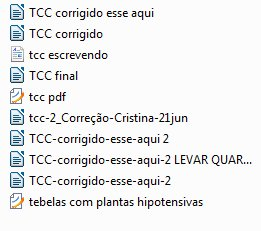
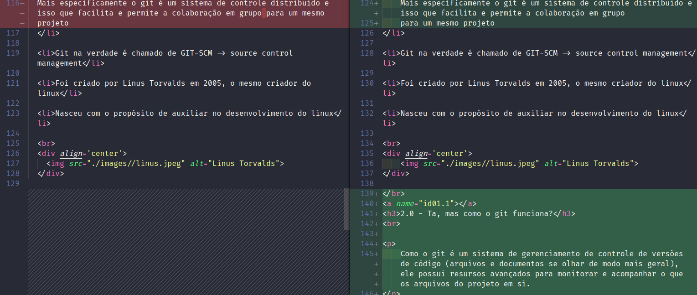
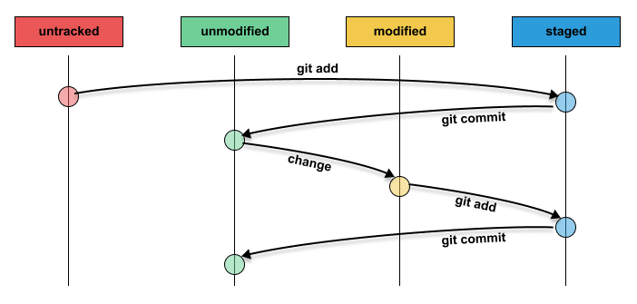
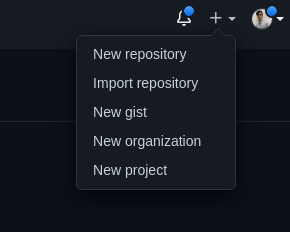

<h1 align='center' name='inicio'>
    Git e GitHub: um guia de estudo, procedimentos e tópicos importantes
</h1>

    

 

# 📋 Indíce

- [1.0 - O que é git ?](#id01)
- [1.1 - Detalhes importantes](#id01.1)
- [2.0 - Ta, mas como o git funciona?](#id02.0)
- [2.1 - Ciclos de vida](#id02.1)
- [3.0 - Criando um gitHub](#id03.0)
- [4.0 - Criando um repositório](#id04.0)

 

    Esse repositório reúne meus estudos e testes sobre git e gitHub. Será um apanhado de informações, se sinta livre
    para ler, salvar, forkar ou compartilhar o projeto, e se achar correções ou melhorias sua contribuição é bem vinda.

 

    Lembrando que todo tipo de opinião sobre o uso de algum conceito ou ferramenta também está atrelado a minha visão da
    forma de se usar ou proceder. Sendo então parcial e não passando de uma recomendação, se acaso algo for normativo
    irei indicar em conjunto a própria informação da mesma.

 

    E se gostou do conteúdo deixe uma estrela para incentivar o trabalho.

 

<h2>1.0 - O que é git ?</h2>

 

    Git é uma ferramenta de versionamento de código, e serve literalmente para criar versões, igual quando temos
    aplicativos com 1.0, 1.2, 2.5 e por aí vai.
    Não entrando em questões de como isso é numerado, a ideia é a mesma, é criado múltiplas versões do item em questão,
    que no caso se faça de código, ou mais especificamente arquivos de código.
    Porém o git é tão poderoso que pode criar versões de qualquer arquivo que se desejar.

 

    Para explicar melhor o conceito de versionamento pode-se citar os diversos trabalhos de escola ou um TCC de curso ou
    graduação. Sempre se inicia com um nome, porém conforme passa por revisões tende-se a mudar o nome do arquivo,
    virando algo como:

 

    Trabalho-revisado

    Trabalho-revisado-final

    Trabalho-revisado-final-agoraVai

 

    

    E isso dificulta muito o controle por que não é possível saber o que foi feito em cada parte, nem mesmo olhando
    daria pra saber exatamente qual a ordem em que vieram. Pois se houverem mais marcações pode gerar confuções.

 

    Com git poderia se manter o nome e geral códigos de marcação e comentários, marcando as versões.

 

Git te responde algumas perguntas básicas sobre as alterações feitas.

 
<ol>
    <li>O que mudou ?</li>
    <li>Quando mudou ?</li>
    <li>Por que mudou?</li>
    <li>Quem fez a mudança?</li>
    <li>Podemos reproduzir essa mudança?</li>
</ol>
 

Isso gera uma estrutura de marcações de commit, que evidencia essas informações.

 

    nome do Trabalho(arquivo) - data de alteração - código único de alteração (hash do commit) - comentário de alteração
    - quem alterou

 

E quanto a replicação do comportamento, podemos conferir nas descrições de alteração dos arquivos alterados ou clonar
    o repositório em si

 

    Seria muito mais fácil de fazer trabalho em grupo usando um versionador, e a ideia é essa mesma, porém com códigos.

 

<h3>1.1 - Detalhes importantes</h3>
 

<li>
    Mais especificamente o git é um sistema de controle distribuido e isso que facilita e permite a colaboração em grupo
    para um mesmo projeto
</li>

<li>Git na verdade é chamado de GIT-SCM -> source control management</li>

<li>Foi criado por Linus Torvalds em 2005, o mesmo criador do linux</li>

<li>Nasceu com o propósito de auxiliar no desenvolvimento do linux</li>

 

    

 

<h3>2.0 - Ta, mas como o git funciona?</h3>
 

    Como o git é um sistema de gerenciamento de controle de versões de código (arquivos e documentos se olhar de modo mais geral), ele possui resursos avançados para monitorar e acompanhar o que os arquivos do projeto em si.

    Isso conta tanto em alterações no arquivo quanto o caminho dentro das pastas (diretórios).

    Isso o permite monitorar todas as mudanças ocorridas, logo a partir do momento que é iniciado no projeto. Geralmente esse processo ocorre no repositório local, e a cada alteração isso é indicado e mapeado pela ferramenta.

 

    

 

    A primeira parte indicada mostra que o código era como estava a esquerda, mas isso foi removido e então está em vermelho.
    E então ficou como está a direita, e como foi adicionado está em verde.

    Sendo na realidade apenas uma mudança de formatação, por isso indica que algo foi removido e agora se tem um novo bloco.

    Já a segunda parte que mostra um espaço vazio a esquerda e um texto em com fundo em verde a direita mostra adição de parte totalmente novas.

 

<h3>2.1 - Ciclos de vida</h3>
 

    As mudanças monitoradas são demonstrada através de um poderoso sistema que pode ser chamado como relativo a estágios ou fases.

 

Cada fase representa algo que ocorre com os arquivos, há imagens com mais detalhes ou até mais comandos ou relações a estados. Mas o primeiro contato está relativo a um ciclo resumido.

    De modo geral, após se linkar um repositório ao git, o sistema git está monitorando esses arquivos, mas eles não foram se quer adicionados para o monitoramentos, então ficam contando estado como untracked.

    Ao usar o comando git add, e o estado do arquivo se torna staged, ou seja, agora o arquivo se torna monitorado pelo sistema git.

    Após isso, se usar o git commit se torna unmodified, que diz que as alterações do arquivo estão fixadas, e também estão como não modificados e podem ser upados para o repositório remoto.

    Qualquer alterações a partir do momento que o arquivo foi adicionado ao monitoramento git, ele se torna modified, indicando que a modificações que devem ser adicionadas.

    Esses são os estados ou fases básicas dp git, a seguir será mencionado com mais detalhes os comandos e ações em geral.

 

<h3>3.0 - Criando um gitHub</h3>
 

    O processo de criação de um gitHub é bem simples é preciso acessar o site do gitHub através do link <a href="https://github.com">https://github.com</a>.

    A tela será a seguinte:

 

    Deve se clicar em <strong>Sign up</strong> no canto superior direito.

    Então preencher os dados comuns, que são email, senha e nome de usuário.

    Também será pedido um número de código que foi enviado para e-mail informado nos daos. Como uma confirmação para e-mail válido.

    Daí é só escolher se você quer receber notificações do gitHub e responder o captcha para concluir a primeira etapa.

    O procedimento pode ser visto na gif abaixo :

 

    

 

    Logo depois há algumas configurações a se preencher

    O primeiro é a pergunta de quantas pessaos atuam na equipe, no geral será respondido "apenas eu", porque é sua conta pessoal. 

 

    

 

    O segundo são possíveis usos para sua conta do gitHub, se tiver focos em mente já é legal colocar. Se não tiver, recomendo colocar pelo menos o último, que menciona comunidade. 

 

    
    
    

 

    O terceiro tópico é sobre escolher modalidade free ou modalidade paga, aqui escolha o free que é mais que suficiente.

 

    

    E pronto, sua conta esta criada e já é possível criar repositórios com projetos, gerar commits e participar da comunidade em si.

 

<h3>4.0 - Criando um repositório</h3>
 

    Primeiramente, cabe dizer que um repositório é no sentido do dicionário, um lugar onde se armazena, guarda, arquiva ou coleciona alguma coisa. E nesse caso, um repositório git se destina, primáriamente, a guardar projetos e códigos. Assim como temos a ferramenta git monitorando as versões dos nossos arquivos dentro de um projeto, teremos os repositórios para alocar os projetos e suas estruturas de pastas e arquivos. 

    Esses repositórios são um ambiente remoto, que alocam os dados em uma espécie de nuvem. Assim, nossos códigos versionados podem ficar em um lugar seguro. E nos permite compartilhar códigos e projetos, demonstrar a evolução dos projetos em si e da nossa maneira de codar e trabalhar com projetos. Além de também nos permitir criar uma espécie de portfólio e mapa de trajetória. 

    Sendo também possível ter contato com códigos e projetos de outros programadores e projetos open source.

    Para criar um repositório é um processo bem simples. Basta clicar no simbolo + (de mais) no canto direito superior da página. Estará entre o sininho de notificações e a foto de perfil.

 

    

    Ao clicar aparecerá opções. Então aparecerá opções, a primeira é para criar um novo repositório.

 

    

 [⬆ Voltar ao top](#inicio)  
